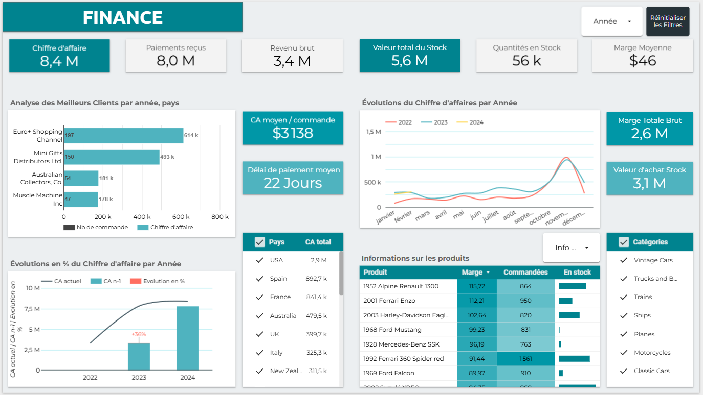
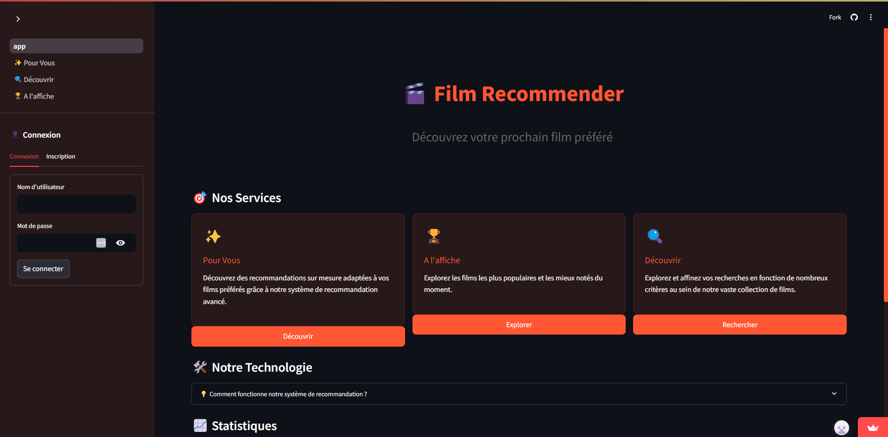
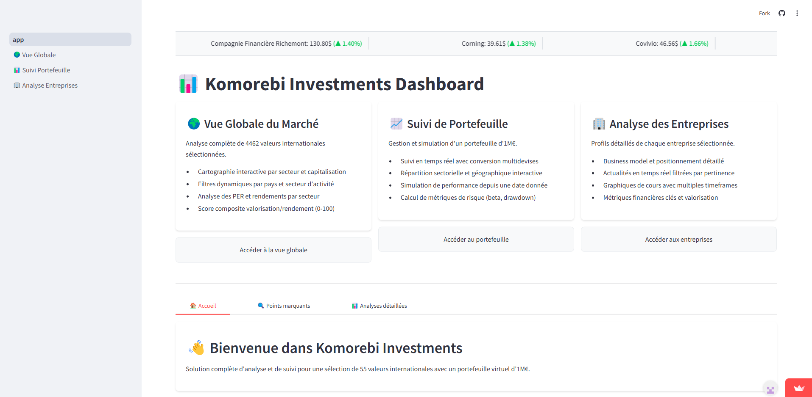
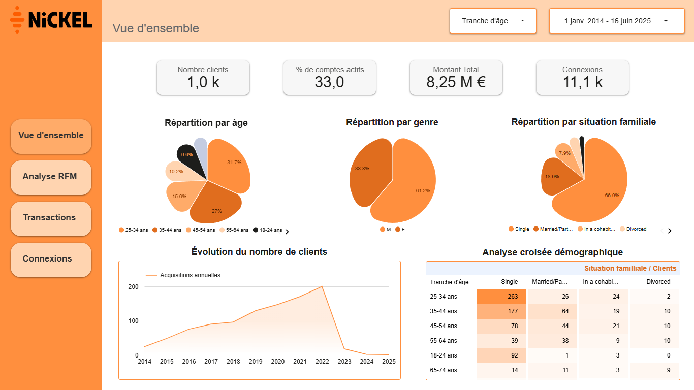
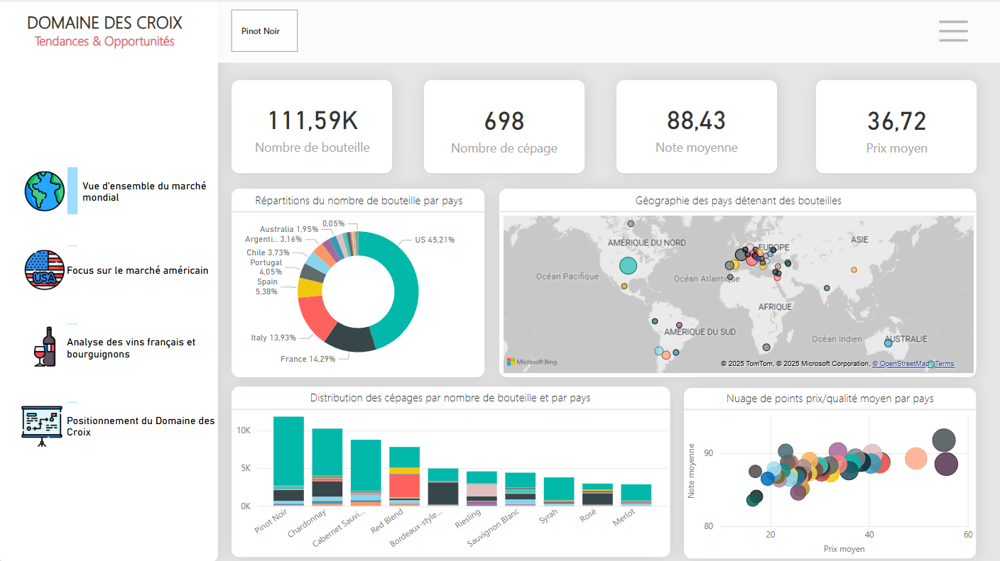

# Lucas Meireles | Data Portfolio

## 👋 À propos de moi

Data Analyst junior passionné par la transformation des données en insights actionnables. En reconversion depuis le commerce vers la data, j'apporte une vision terrain et une compréhension des enjeux business qui donnent du sens à mes analyses. Certifié par la Wild Code School, je combine des compétences techniques en analyse de données avec une expérience pratique en exploration, visualisation et en machine learning.

🎯 **Je suis à la recherche d'une alternance en Data pour septembre 2025** dans le cadre de mon cursus Big Data & IA chez Sup de Vinci (2025-2027).

Rythme : 3 semaines en entreprise / 1 semaine en formation

---

## 💼 Projets

### 📈 [Dashboard Business Intelligence - Analyse des ventes](https://lookerstudio.google.com/reporting/aecc1dc9-d2e5-4a07-9119-1ce229e23bae)

**Technologies**: Looker Studio, SQL, Python  
**Impact métier**: Optimisation du suivi commercial et identification des leviers de croissance

**Résultats mesurables**:
- ✅ Exploration d'une base de données client et analyse approfondie des KPIs critiques
- ✅ Création de visualisations dynamiques pour le suivi de la performance des représentants commerciaux
- ✅ Analyse de performance de 15+ représentants commerciaux
- ✅ Dashboard interactif avec KPIs critiques

[📖 Voir le dashboard](https://lookerstudio.google.com/reporting/aecc1dc9-d2e5-4a07-9119-1ce229e23bae) | [🔗 Plus de détails](https://wildcodeschool.github.io/data-training-resources/projet/projet-1/)

---

### 🎬 [Système de Recommandation de Films - Style Netflix](https://film-recommender-lfe-app.streamlit.app)

**Technologies**: Python (Scikit-learn), Streamlit, API TMDB  
**Impact métier**: Amélioration de l'engagement utilisateur par la personnalisation

**Résultats mesurables**:
- ✅ Analyse de **5 000 000+ films** (IMDb + TMDB)
- ✅ Algorithme de machine learning avec **3 méthodes** de recommandation
- ✅ Interface déployée sur Streamlit Cloud
- ✅ Temps de réponse des recommendations optimisées

[📖 Voir le code](https://github.com/Lu6asM/film-recommender) | [🔗 Plus de détails](https://wildcodeschool.github.io/data-training-resources/projet/projet-2/) | [🎬 Voir l'application](https://film-recommender-lfe-app.streamlit.app)

---

### 💰 [Application de suivi de portefeuille boursier](https://komorebi-investments.streamlit.app)

**Technologies**: Python, PostgreSQL, MageIA, AWS, Streamlit  
**Impact métier**: Aide à la décision d'investissement basée sur l'analyse quantitative

**Résultats mesurables**:
- ✅ Suivi en temps réel de **55 valeurs** boursières
- ✅ Pipeline de données automatisé pour **500+** valeurs boursières
- ✅ Calcul d'**indicateurs** de performance financière
- ✅ Architecture cloud scalable (AWS + PostgreSQL)
- ✅ Interface responsive et intéractive

[📖 Voir le code](https://github.com/Lu6asM/Finance-Co) | [🔗 Plus de détails](https://wildcodeschool.github.io/data-training-resources/projet/projet-3/wild-data-hub/) | [📈 Voir l'application](https://komorebi-investments.streamlit.app)

---

## 📊 Dashboards & Analyses Business

### 💼 [Analyse Démographique Nickel - Test Technique](https://lookerstudio.google.com/reporting/a3113086-b9b0-41a8-8e9a-8658b96a0af2)

**Technologies**: Looker Studio, Python
**Impact métier**: Dashboard réalisé pour un processus de recrutement fintech

**Résultats mesurables**:
- ✅ Analyse démographique de 1k clients
- ✅ Segmentation par âge, genre, situation familiale
- ✅ Évolution des acquisitions clients 2014-2025
- ✅ Création d'une segmentation RFM

[📖 Voir le dashboard](https://lookerstudio.google.com/reporting/a3113086-b9b0-41a8-8e9a-8658b96a0af2)

---

### 🏆 Analyse Marché Viticole - Projet de Certification

**Technologies**: Power BI, Python, SQL
**Impact métier**: Stratégie de pricing pour l'export US de vin

**Résultats mesurables**:
- ✅ Analyse de 130k références mondiales
- ✅ Recommandations stratégiques validées
- ✅ Dashboard interactif multi-niveaux

**Retour formateur:** "Rapport très attrayant visuellement, candidat professionnel avec un bon raisonnement sur la proposition de prix"

[📖 Voir le dashboard](assets/bi/dashboard1.pbix) | [🔗 Plus de détails](assets/bi/dashboard1-pres.pdf)

---

## 🛠️ Stack technique

### 🐍 **Langages & Frameworks**

### 🤖 **Data Science & ML**

### 📊 **Visualisation & BI**

### 🗄️ **Bases de données & Cloud**

### 🔄 **Outils & Méthodes**

---

## 🎓 Formation & Certifications

- 🎯 [**Mastère Big Data & IA en alternance**](https://www.supdevinci.fr/formations/mastere-specialisation-big-data/) | Sup de Vinci | Septembre 2025 - 2027 (en alternance)
- ✅ [**Certification Data Analyst**](assets/resume/certification-data-analyst.pdf) | Wild Code School | Sept 2024 - Fév 2025  
  *Formation intensive 5 mois : Python, SQL, ML, Visualisation*
- ✅ **BTS Professions Immobilières** | IESCA, Nantes | 2019 - 2021
- ✅ **Bac Pro Commerce** | Lycée Notre Dame, Challans | 2016 - 2019

---

## 💼 Recherche d'alternance

### 🎯 **Objectif**
Alternance en Big Data & IA - **Septembre 2025**

### ⏰ **Modalités**
- **Rythme** : 3 semaines entreprise / 1 semaine formation
- **Durée** : 2 ans (jusqu'en 2027)
- **Localisation** : Nantes et région Pays de la Loire + télétravail partiel

### 💪 **Ce que j'apporte**
- ✅ **Compétences techniques** prouvées sur 3 projets concrets
- ✅ **Polyvalence** : BI, ML, développement, déploiement
- ✅ **Résultats mesurables** dans mes réalisations
- ✅ **Autonomie** et capacité d'adaptation démontrées
- ✅ **Vision business** grâce à mon expérience en commerce/immobilier

---

## 📫 Contact

💌 **Email** : [lucasmeireles85@gmail.com](mailto:lucasmeireles85@gmail.com)  
🔗 **LinkedIn** : [linkedin.com/in/lucasmeireles85](https://linkedin.com/in/lucasmeireles85)  
📱 **Téléphone** : 06 40 31 81 93  
📍 **Localisation** : Nantes, Pays de la Loire (rayon 30km)

📄 **CV complet** : [Voir PDF](assets/resume/CV_Lucas_Meireles.pdf)

---

### 💡 Intéressé par mon profil pour une alternance ?

**[📧 Contactez-moi](mailto:lucasmeireles85@gmail.com)** • **[📞 Appelez-moi](tel:+33640318193)** • **[💼 LinkedIn](https://linkedin.com/in/lucasmeireles85)**

*Disponible pour un entretien dans les 48h*

